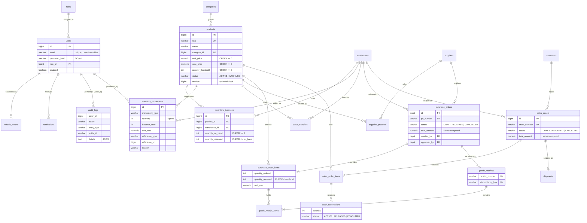

# StockPilot — Entity Relationship Diagram

GitHub renders this Mermaid diagram automatically. The authoritative schema is
`backend/src/main/resources/db/migration/V1__initial_schema.sql`.

```mermaid
erDiagram
    roles ||--o{ users : "assigned to"
    users ||--o{ refresh_tokens : "has sessions"
    users ||--o{ notifications : receives
    users ||--o{ audit_logs : "performed (actor_id)"

    categories ||--o{ products : groups
    products ||--o{ inventory_balances : "stocked as"
    warehouses ||--o{ inventory_balances : holds
    products ||--o{ inventory_movements : "ledger for"
    warehouses ||--o{ inventory_movements : "ledger for"
    users ||--o{ inventory_movements : "performed_by"
    products ||--o{ stock_transfers : moves
    warehouses ||--o{ stock_transfers : "from / to"

    suppliers ||--o{ supplier_products : offers
    products ||--o{ supplier_products : "offered by"
    suppliers ||--o{ purchase_orders : receives
    warehouses ||--o{ purchase_orders : "delivered to"
    purchase_orders ||--|{ purchase_order_items : contains
    products ||--o{ purchase_order_items : ordered
    purchase_orders ||--o{ goods_receipts : "received via"
    goods_receipts ||--|{ goods_receipt_items : contains
    purchase_order_items ||--o{ goods_receipt_items : fulfils

    customers ||--o{ sales_orders : places
    warehouses ||--o{ sales_orders : "ships from"
    sales_orders ||--|{ sales_order_items : contains
    products ||--o{ sales_order_items : sold
    sales_order_items ||--o{ stock_reservations : reserves
    sales_orders ||--o| shipments : "shipped as"

    products {
        bigint id PK
        varchar sku UK
        varchar name
        bigint category_id FK
        numeric unit_price "CHECK >= 0"
        numeric cost_price "CHECK >= 0"
        int reorder_threshold "CHECK >= 0"
        varchar status "ACTIVE | ARCHIVED"
        bigint version "optimistic lock"
    }
    inventory_balances {
        bigint id PK
        bigint product_id FK
        bigint warehouse_id FK
        int quantity_on_hand "CHECK >= 0"
        int quantity_reserved "CHECK <= on_hand"
    }
    inventory_movements {
        bigint id PK
        varchar movement_type
        int quantity "signed"
        int balance_after
        numeric unit_cost
        varchar reference_type
        bigint reference_id
        varchar reason
    }
    purchase_orders {
        bigint id PK
        varchar po_number UK
        varchar status "DRAFT..RECEIVED | CANCELLED"
        numeric total_amount "server computed"
        bigint created_by FK
        bigint approved_by FK
    }
    purchase_order_items {
        int quantity_ordered
        int quantity_received "CHECK <= ordered"
        numeric unit_cost
    }
    goods_receipts {
        varchar receipt_number UK
        varchar idempotency_key UK
    }
    sales_orders {
        bigint id PK
        varchar order_number UK
        varchar status "DRAFT..DELIVERED | CANCELLED"
        numeric total_amount "server computed"
    }
    stock_reservations {
        int quantity
        varchar status "ACTIVE | RELEASED | CONSUMED"
    }
    users {
        bigint id PK
        varchar email "unique, case-insensitive"
        varchar password_hash "BCrypt"
        bigint role_id FK
        boolean enabled
    }
    audit_logs {
        bigint actor_id
        varchar action
        varchar entity_type
        varchar entity_id
        text details "JSON"
    }
```
